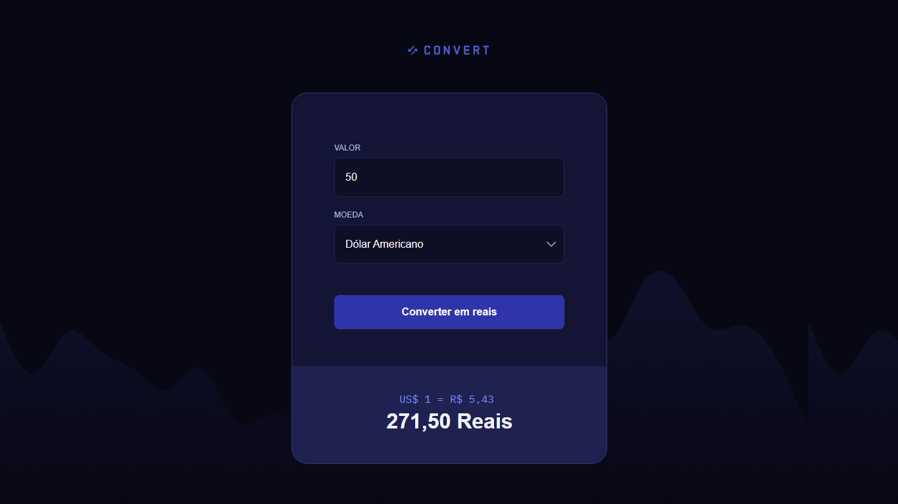

# 💱 Convert

Este é um projeto simples de **conversão de moedas** desenvolvido em JavaScript. Ele permite que você insira um valor e selecione uma moeda para converter em Reais (BRL).



## 🚀 Funcionalidades

- Conversão para as seguintes moedas:
  - 🇺🇸 Dólar Americano (USD)
  - 🇪🇺 Euro (EUR)
  - 🇬🇧 Libra Esterlina (GBP)
  - 🇯🇵 Iene Japonês (JPY)
  - 🇨🇦 Dólar Canadense (CAD)
  - 🇦🇺 Dólar Australiano (AUD)
- Exibe a taxa de conversão atual para Reais.
- Alerta o usuário em caso de valor inválido.

## 📋 Tecnologias Utilizadas

- **HTML**: Estrutura do formulário.
- **CSS**: Estilização básica.
- **JavaScript**: Lógica de conversão e manipulação do DOM.

## 🔧 Como Usar

**1.** Clone este repositório:

```bash
git clone https://github.com/joschonarth/convert.git
```

**2.** Abra o arquivo `index.html` no seu navegador.

**3.** Insira o valor a ser convertido.

**4.** Escolha a moeda desejada e veja o resultado da conversão em Reais.

## 📝 Observações
O projeto utiliza valores fixos de conversão para cada moeda. As taxas podem não refletir as cotações atuais do mercado.

## 🤝 Contribuições
Sinta-se à vontade para contribuir com melhorias para este projeto. Faça um fork e envie um pull request. 🚀